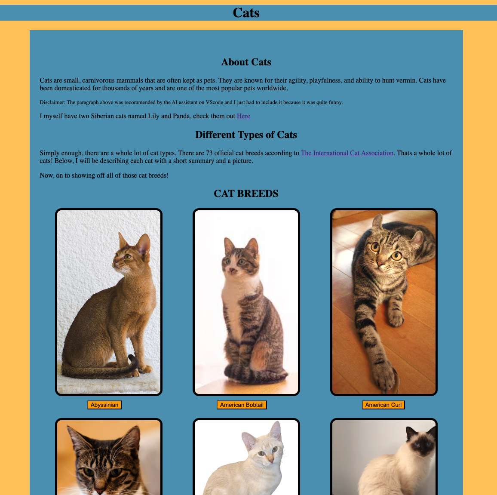

# cat website
This is a simple HTML website that I coded pretty much entirely by hand to gain a better understanging of HTML and CSS. Along the way, I learned a whole lot about many different cat breeds. I also practiced my writing skills and this was overall very goood practice for my coding and writing skills. 

    

 
