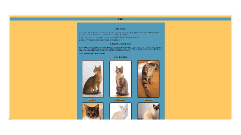

# Cat website (could be called Catpedia)
This is a simple HTML website that I coded pretty much entirely by hand to gain a better understanging of HTML and CSS. Along the way, I learned a whole lot about many different cat breeds. I also practiced my writing skills and this was overall very goood practice for my coding and writing skills. The CSS is also really simple, being only 1 CSS file for the whole project. The CSS does its job though and makes the site look great.

    

 
Its really simple and is hosted on GitHub Pages making it simpler than creating some server or whatever is required to make a website. It is pretty self-explanatory, just a list of cats with buttons under them linking them to other sites about cats. The link to the deployed site is: https://couchpotatoe1234.github.io/Cats-Site/index.html